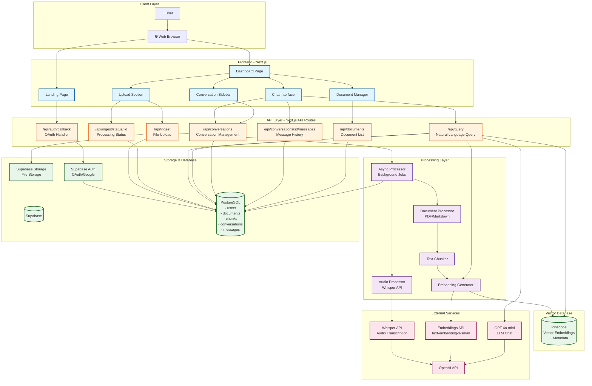

**Twin Mind - Second Brain**  

For this assessment I have implemented two modalities - Audio and documents(pdf, .md). Below explanation considers all the requirements and future considerations. 

Architecture  
Functional Requirements

1. Users should be able to upload audio files (such as .mp3, .m4a) and have the system transcribe the spoken words.  
2. Users should be able to upload document files (.pdf, .md) and have the system extract the text and relevant metadata.  
3. Users should be able to provide a URL and have the system scrape and process the main text content of a web page.  
4. Users should be able to enter plain text or notes for the system to process and store.  
5. Users should be able to upload images, which the system will store and make searchable via associated text or metadata.

Non-Functional Requirements

1. Low Latency: 
   * Query Response: The system should have low latency (< 5s end-to-end latency under typical network conditions) for natural language queries and responses.
   * File Upload: File uploads should return immediately (< 2s) with asynchronous processing happening in the background. For audio files, transcription can take several minutes depending on file length, but users receive immediate feedback and can track processing status.
   * Processing Status: Status updates should be available within 2 seconds of polling requests. 
2. Durability: The system should be durable, the data should not be lost.  
3. Consistency Over Availability: The system should prioritize consistency over availability. The user should get up-to-date information, availability is still important but temporary downtime is often preferable to serving stale or incorrect data.

Core Entities

1. User: Who will be using this AI personal companion.  
2. Content: This represents any resource ingested by the user (documents, audio, notes, images, or web page), with which the user will interact.  
3. Conversation: A chat session that groups related queries and responses together, enabling context continuity and conversation history management.  
4. Query: What the user asks in natural language to get answers from the content they have uploaded.  
5. LLM Response: This represents the response, which itself is an entity that can be stored, referenced, or tied back to the query and source knowledge. Useful for user history, feedback, and system analytics.

2\. High-Level Design (HLD)

**System Architecture Diagram**

Below system design diagram shows how the system function on different steps: 

**Information Retrieval and Querying Strategy**

A Hybrid Approach combining the following:

* Semantic Search: For intent and fuzzy search using vector embeddings.  
* Full-Text Search: For fast, reliable retrieval when users know specific terms, phrases, tags, or technical jargon.  
* Conversation Context: Each query maintains conversation history and AI memory context from previous conversations, enabling contextual, continuous interactions with the knowledge base.

**Future Scalability Options:**

* Graph-Based Search: As the system scales, graph-based search can be implemented to model relationships between documents, chunks, conversations, and entities. This would enable more sophisticated context and relationship-based retrieval, such as finding related documents based on shared concepts, tracking information flow across conversations, or discovering connections between different knowledge domains.

**How is raw data processed and "chunked" for indexing?**

**Ingestion and Data Processing**

* Users upload raw content (Audio, PDF, Markdown, plain text, image, or web page URL) to Supabase Storage.  
  * Extraction is performed based on content type:  
    * **Audio:** Transcribed to text via ASR (e.g., using Whisper).  
    * **PDF / Markdown / Web Pages:** Parsed for text and metadata.  
    * **Images:** Metadata and text extracted using OCR or a vision model.

* After extraction, the data is cleaned and prepared (removing formatting issues, duplicates, or irrelevant noise).  
  **Indexing**  
  Rule-based chunking: Processed data is broken into chunks using fixed chunk sizes, section boundaries, and token limits. Chunks maintain logical coherence to preserve context for future retrieval.  
  **Storing and Retrieval**  
  Chunks are converted into vector embeddings and stored in Pinecone for fast semantic searches. Associated metadata is stored in Postgres. Each chunk preserves local context and acts as a unit of retrieval, enabling both historical and real-time use.

**Indexing Technique**

* Rule-based indexing.

**Database Schema**

The design uses **Supabase (hosted Postgres)** to store metadata and Pinecone for vector embeddings. Supabase provides built-in authentication, real-time subscriptions, and Row Level Security (RLS) for enhanced data protection.

**Supabase Tables**

* Table: users
  * id: UUID, Primary key, unique ID
  * email: TEXT, Unique user email
  * name: TEXT, User display name
  * created\_at: TIMESTAMP WITH TIME ZONE

* Table: documents
  * id: UUID, Unique document identifier
  * user\_id: UUID, Foreign key → users(id)
  * title: TEXT, Document/Note title
  * source\_type: TEXT, Content type (audio, pdf, markdown)
  * source\_uri: TEXT, File path/URL
  * created\_at: TIMESTAMP WITH TIME ZONE, Original creation date
  * ingested\_at: TIMESTAMP WITH TIME ZONE, When added to system
  * tags: TEXT\[\], Subject tags/labels
* Table: chunks
  * id: UUID, Primary key, chunk ID
  * document\_id: UUID, Foreign key → documents(id)
  * chunk\_index: INTEGER, Order of chunk in document
  * chunk\_text: TEXT, Raw chunk text
  * embedding\_id: TEXT, Reference to Pinecone vector ID
  * created\_at: TIMESTAMP WITH TIME ZONE, When chunk created
  * processed\_flag: BOOLEAN, For async processing (default false)
  * metadata: JSONB, Chunk metadata (stores additional chunk information)
  * UNIQUE constraint on (document\_id, chunk\_index)

* Table: conversations
  * id: UUID, Primary key, unique conversation ID
  * user\_id: UUID, Foreign key → users(id)
  * title: TEXT, Conversation title (auto-generated from first message or user-defined)
  * created\_at: TIMESTAMP WITH TIME ZONE, When conversation was created
  * updated\_at: TIMESTAMP WITH TIME ZONE, Last message timestamp (auto-updated)

* Table: messages
  * id: UUID, Primary key, unique message ID
  * conversation\_id: UUID, Foreign key → conversations(id)
  * role: TEXT, Message role (user, assistant, system)
  * content: TEXT, Message content
  * sources: JSONB, Array of source references (document IDs, chunk IDs)
  * created\_at: TIMESTAMP WITH TIME ZONE, When message was created

**Pinecone**

This stores the chunks as vector embeddings.

* id: unique identifier (reference to chunks.embedding\_id in Postgres)  
* values: the vector embedding array  
* metadata:  
  * user\_id  
  * document\_id  
  * chunk\_index  
  * source\_type  
  * created\_at (timestamp)  
  * ingested\_at (timestamp)  
  * tags 
  * title

**What are the trade-offs of your chosen storage solution (e.g., SQL vs. NoSQL vs. Vector DB) in terms of scalability, cost, and query flexibility?**

By using Supabase (hosted SQL) alongside a Vector DB (Pinecone), my design achieves strong separation of concerns and high scalability. Supabase provides:
* Structured metadata storage with full Postgres capabilities
* Complex filtering and relational queries
* Built-in authentication and Row Level Security (RLS)
* Real-time subscriptions for live updates
* Auto-scaling infrastructure
* Robust data integrity for thousands of documents per user

Pinecone handles high-dimensional semantic search at scale, making it ideal for AI-driven retrieval and similarity queries across large datasets.

The trade-off is that maintaining both Supabase and Pinecone systems incurs slightly higher operational costs and architectural complexity compared to a single NoSQL or SQL-only solution. However, the performance, scaling, and query flexibility benefits are significant: Supabase delivers efficient joins, time-based filtering, and real-time capabilities, while Pinecone powers fast, accurate semantic search. This hybrid approach combines best-in-class features from both worlds, ensuring modern AI and retrieval workloads are handled efficiently without compromise.

4\. **Conversation Management and AI Memory Context**

* Conversation Persistence: Each user query is associated with a conversation, allowing users to maintain separate chat sessions for different topics or contexts. Conversations can be created, renamed, and deleted by users.
* Conversation History: All messages (user queries and assistant responses) within a conversation are stored in the messages table, enabling full conversation context to be maintained and retrieved.
* AI Memory Context: To provide continuity across conversations, the system implements an AI Memory feature that:
  * Loads the last 3 conversations (excluding the current one)
  * Extracts the last 10 messages from each of those conversations
  * Includes this context in the LLM system prompt as "Previous conversation context (AI Memory)"
  * Enables the assistant to reference previous discussions and maintain context across different conversation sessions
* Auto-Title Generation: Conversation titles are automatically generated from the first user message, but can be manually updated by users.
* Use Cases: This enables users to have contextual, continuous interactions with their knowledge base, where the AI remembers previous discussions and can build upon them, even across different conversation sessions.

5\. **Temporal Querying Support**

* Timestamps: Each document and chunk is tagged with precise created\_at and ingested\_at timestamps (TIMESTAMP WITH TIME ZONE) in both Supabase and Pinecone metadata.
* Retrieval Strategy: Time-based queries filter data using these timestamps, enabling direct retrieval or semantic search of all content within any specified time window. Users can query for documents or chunks created or ingested during specific periods, such as "last month", "yesterday", "this week", or custom date ranges.
* Use Cases: Temporal querying enables users to find information based on when it was added to the system, track their knowledge base growth over time, and retrieve contextually relevant information from specific time periods.

**6\. Scalability and Privacy**

My design handles thousands of documents for a single user by:

* Storing user content in Supabase Storage, which supports unlimited data growth, high user concurrency, and built-in replication/backups.
* Managing metadata and content chunks in **Supabase** (auto-scaling Postgres) and **Pinecone** databases, ensuring fast, reliable retrieval and semantic search even as data size grows.
* Leveraging Supabase's connection pooling and serverless architecture for optimal performance under load.

Privacy by Design

* **Cloud-Hosted Solution (Current Implementation)**: Offers enterprise-grade scalability and security:
  * **Supabase**: Built-in Row Level Security (RLS), encryption at rest and in transit, strict user-based access controls
  * **Pinecone**: Isolated namespace per user for data segregation
  * Seamless access from any device
  * All data records carry precise timestamps for auditability
  * Automatic backups and replication
  * Serverless architecture with auto-scaling

* **Local-First Option (Future Consideration)**: For highly sensitive data or offline-first requirements, a local-first approach could be implemented. This would involve:
  * **Benefits:**
    * Enhanced privacy: Data never leaves user's device
    * Offline functionality: Full access without internet connection
    * Reduced cloud costs: No storage or processing fees
    * Complete data control: User owns and manages all data locally
    * Lower latency: No network round-trips for local queries
  * **Trade-offs:**
    * No cross-device synchronization: Data isolated to single device
    * Manual backup management: User responsible for data backups
    * Limited scalability: Constrained by local device storage and processing power
    * Complex sync logic: Would require sophisticated conflict resolution if multi-device support is added
    * No automatic updates: User must manually manage software and data
    * Reduced collaboration: Cannot easily share or collaborate on knowledge base
    * Device dependency: Data loss risk if device fails without backups
    * Limited AI capabilities: Cannot leverage cloud-based vector search at scale without syncing to cloud
  * **Hybrid Approach (Potential)**: A hybrid model could selectively store sensitive documents locally while keeping less sensitive content in the cloud, though this would add significant architectural complexity.